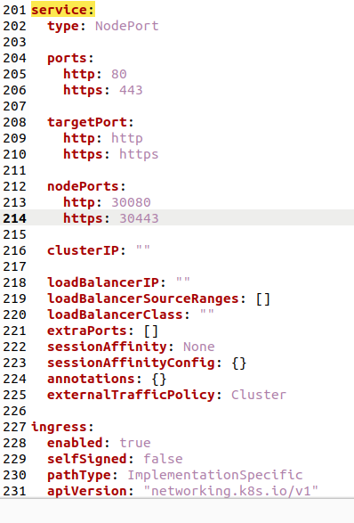
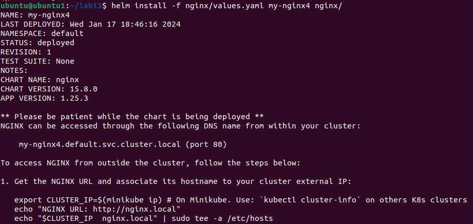
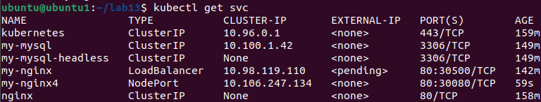
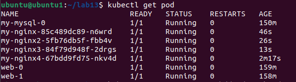
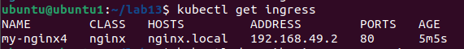
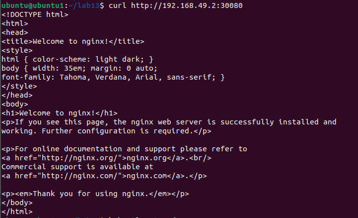
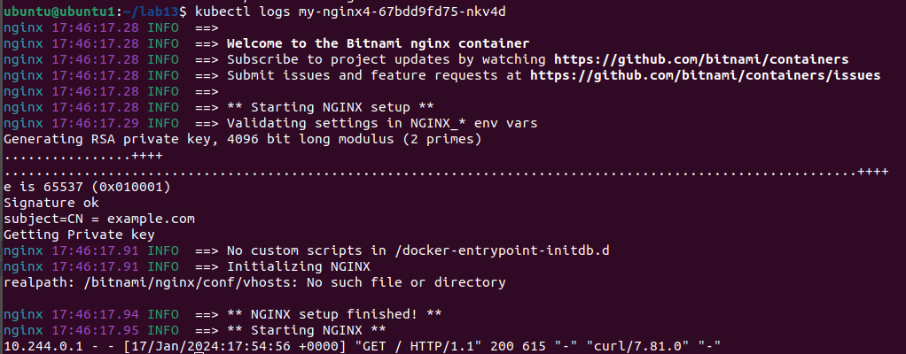

<h1>Laboratorium 13</h1>
<h2>Dominika Skolimowska</h2>

Aby serwer byl dostepny w ramach Ingresu, nalezalo wprowadzic ponizsze zmiany w pliku values.yaml. Trzeba bylo wykorzystac NodePort oraz ustawic <i>enabled</i> w ingressie na <i>true</i>.

Nastepnie nalezalo przeprowadzic instalacje:

Nalezy sprawdzwic czy zostaly utworzone service, pody oraz ingress:

Teraz probujemy sie polaczyc:

I sprawdzamy logi poda: 

Wszystko dziala tak jak nalezy!

